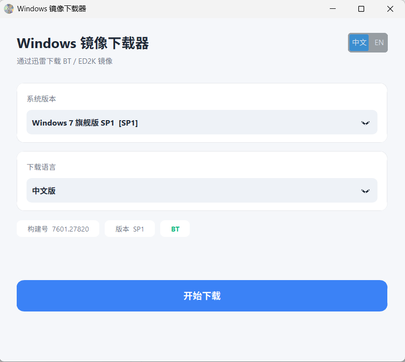

# WinDownload

一个轻量的 Windows 镜像下载工具，通过调用迅雷下载 BT / ED2K 链接，一键获取 Windows 7 / 8 / 8.1 / 10 / 11 的官方镜像。

## 功能特点

- 支持 Windows 7、8、8.1、10、11 及后续新增版本
- 支持 BT 磁力链接和 ED2K 链接
- 自动复制链接到剪贴板并唤起迅雷
- 每个系统提供中文版 / 英文版两个分支
- 界面语言可切换（中文 / English）
- 版本列表、构建号、版本代号从远程 JSON 动态加载，新增版本无需更新程序
- 现代浅色 UI，基于 CustomTkinter

## 使用方法

1. 从 Releases 页面下载最新的 `Windows 镜像下载器.exe`
2. 确保电脑上已安装迅雷
3. 双击运行，选择系统版本和语言
4. 点击「开始下载」，程序会自动唤起迅雷并开始下载

## 注意事项

- 本工具仅提供下载入口，不托管任何镜像文件
- 所有镜像链接均来自公开网络，版权归微软所有
- 下载前请确保已安装迅雷客户端
- 如提示「找不到迅雷」，请手动安装迅雷

## 常见问题

**Q：为什么点击下载后没反应？**

A：请确认已安装迅雷。程序会自动查找迅雷的常见安装路径、注册表，如果都没找到会提示。你也可以手动打开迅雷，然后从剪贴板粘贴链接新建任务。

**Q：为什么某些版本提示「暂不支持」？**

A：该版本对应语言的 `url` 字段为空。需要维护者在 `windows_links.json` 中补充链接。

**Q：下载速度慢怎么办？**

A：本工具只负责把链接交给迅雷，实际下载速度由迅雷决定，与种子活跃度、网络环境有关。

## 许可

本项目仅供学习交流使用，请勿用于商业用途。
